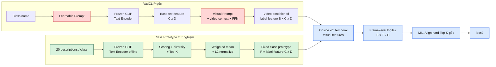

# VadCLIP Direct Class Prototypes

Thí nghiệm này thay Learnable Prompt và Visual Prompt của A-branch bằng class
prototype cố định. Temporal encoder, C-branch và MIL-Align hard Top-K gốc vẫn giữ nguyên.

## Pipeline cập nhật

Pipeline gồm hai giai đoạn độc lập: xây dựng prototype offline và huấn luyện VadCLIP.

### Giai đoạn A — Xây dựng class prototype offline

```text
14 class UCF-Crime
        │
        ▼
20 description cho mỗi class
(chủ thể + hành động, không a/an/the, tránh tính từ)
        │
        ▼
Frozen CLIP Text Encoder ViT-B/16
        │
        ▼
L2-normalized description embeddings
[14, 20, 512]
        │
        ├── gần class-name anchor
        ├── gần leave-one-out centroid cùng class
        └── xa centroid class khác gần nhất
        │
        ▼
Semantic score
score = 0.4 × name + 0.3 × intra - 0.3 × inter
        │
        ▼
Xếp hạng + diversity filtering
(cosine threshold = 0.90)
        │
        ▼
Top-5 description embeddings mỗi class
        │
        ▼
Weighted mean theo softmax(score / 0.10)
        │
        ▼
L2 normalization
        │
        ▼
Fixed class prototypes P [14, 512]
        │
        ├── ucf_crime.pt
        └── ucf_crime_selection.json
```

CLIP Text Encoder chỉ chạy ở bước offline này. Prototype sau khi tạo được cache và
không nhận gradient trong quá trình huấn luyện.

### Giai đoạn B — Huấn luyện với prototype

```text
Precomputed CLIP video features [B, T, 512]
                         │
                         ▼
               VadCLIP temporal encoder
                         │
                         ▼
               Visual features V [B, T, 512]
                         │
             ┌───────────┴───────────┐
             │                       │
             ▼                       ▼
          C-branch                 A-branch
       classifier + MLP       normalize(V) @ normalize(P)ᵀ
             │                  / temperature 0.07
             ▼                       │
     anomaly logits1                 ▼
         [B, T, 1]          class logits2 [B, T, 14]
             │                       │
             ▼                       ▼
   Hard Top-K gốc theo T    Hard Top-K gốc theo T và class
   K = floor(Tvalid/16)+1   K = floor(Tvalid/16)+1
             │                       │
             ▼                       ▼
          loss1                   loss2
             │                       │
             └───────────┬───────────┘
                         ▼
                total loss = loss1 + loss2
```

MIL-Align không bị loại bỏ. A-branch vẫn chọn hard Top-K temporal logits riêng cho
từng class rồi tính weakly-supervised classification loss như baseline.

### So với VadCLIP gốc

Phần được thay đổi nằm trước bước tạo `logits2`. Hai khối **Learnable Prompt** và
**Visual Prompt** của pipeline gốc được thay bằng quá trình xây dựng **Fixed Class
Prototype** offline. Prototype cuối cùng chính là label feature mới.



Màu đỏ là cơ chế gốc bị loại khỏi cấu hình thử nghiệm; màu xanh lá là cơ chế
prototype thay thế; màu xanh dương là pipeline dùng chung được giữ nguyên.

```text
PHẦN GỐC BỊ THAY

Class name
    +
Learnable Prompt
    |
    v
Frozen CLIP Text Encoder
    |
    v
Base text feature [C, D]
    |
    v
Visual Prompt + video context + FFN
    |
    v
Video-conditioned label feature [B, C, D]

                  ĐƯỢC THAY BẰNG

Descriptions theo class
    |
    v
Frozen CLIP Text Encoder chạy offline
    |
    v
Scoring + diversity filtering + Top-K descriptions
    |
    v
Weighted mean + L2 normalization
    |
    v
Fixed class prototype P [C, D]
    = label feature mới

                  PHẦN SAU GIỮ NGUYÊN

Temporal visual features [B, T, D]
    +
Label feature [C, D]
    |
    v
Cosine similarity / 0.07
    |
    v
Frame-level logits2 [B, T, C]
    |
    v
MIL-Align hard Top-K theo class
    |
    v
loss2
```

Điểm cần phân biệt: pipeline mới **vẫn tạo label feature**. Tuy nhiên, label feature
mới là prototype cố định `[C, D]`, dùng chung cho mọi video; nó không còn là label
feature phụ thuộc video `[B, C, D]` như đầu ra của Visual Prompt gốc.

| Thành phần | VadCLIP gốc | Class Prototype thử nghiệm |
|---|---|---|
| Learnable Prompt | Có | Bỏ |
| CLIP Text Encoder | Frozen, chạy trong forward | Frozen, chỉ chạy offline |
| Visual Prompt | Có | Bỏ |
| Text representation | Phụ thuộc training và video | Prototype cố định |
| Temporal encoder | Có | Giữ nguyên |
| C-branch | Có | Giữ nguyên |
| MIL-Align hard Top-K | Có | Giữ nguyên |
| `loss1` | Có | Giữ nguyên |
| `loss2` | Có | Giữ nguyên |
| `loss3` text separation | Có | Tắt vì prototype cố định |

Thí nghiệm đầu tiên chỉ đánh giá Class Prototype với Top-K gốc. AIS và Temporal
Segment Top-K không được bật để tránh thay đổi đồng thời nhiều cơ chế.

### Ablation Class Prototype

Thứ tự ablation sử dụng cùng description, CLIP checkpoint, semantic score và class
order. Chỉ thay selection, diversity filtering hoặc aggregation:

```text
A0: Top-1
    20 candidates → chọn embedding score cao nhất → 1 prototype

A1: Top-K Mean
    20 candidates → score-ranked Top-K → mean → normalize

A2: Diversity-filtered Top-K
    20 candidates → score ranking → diversity filtering → mean → normalize

A3: Weighted Top-K
    20 candidates → score-ranked Top-K → weighted mean → normalize

A4: Diversity-filtered + Weighted Top-K
    20 candidates → score ranking → diversity filtering
                  → weighted mean → normalize
```

| ID | K | Diversity | Aggregation | Mục đích |
|---|---:|---:|---|---|
| A0 | 1 | Không | Mean | Một description tốt nhất |
| A1 | 5 | Không | Mean | Đo lợi ích multi-description |
| A2 | 5 | Có, `0.90` | Mean | Đo riêng lợi ích diversity |
| A3 | 5 | Không | Weighted mean | Đo riêng lợi ích weighting |
| A4 | 5 | Có, `0.90` | Weighted mean | Kết hợp diversity và weighting |

Lệnh build tương ứng:

```bash
# A0 — Top-1
python experiments/class_prototypes/build_prototypes.py \
  --top-k 1 \
  --disable-diversity-filter \
  --aggregation mean \
  --output outputs/class_prototypes/a0_top1.pt \
  --audit-output outputs/class_prototypes/a0_top1.json

# A1 — Top-K Mean
python experiments/class_prototypes/build_prototypes.py \
  --top-k 5 \
  --disable-diversity-filter \
  --aggregation mean \
  --output outputs/class_prototypes/a1_topk_mean.pt \
  --audit-output outputs/class_prototypes/a1_topk_mean.json

# A2 — Diversity-filtered Top-K Mean
python experiments/class_prototypes/build_prototypes.py \
  --top-k 5 \
  --diversity-threshold 0.90 \
  --aggregation mean \
  --output outputs/class_prototypes/a2_diverse_topk_mean.pt \
  --audit-output outputs/class_prototypes/a2_diverse_topk_mean.json

# A3 — Weighted Top-K
python experiments/class_prototypes/build_prototypes.py \
  --top-k 5 \
  --disable-diversity-filter \
  --aggregation weighted_mean \
  --weight-temperature 0.10 \
  --output outputs/class_prototypes/a3_weighted_topk.pt \
  --audit-output outputs/class_prototypes/a3_weighted_topk.json

# A4 — Diversity-filtered + Weighted Top-K
python experiments/class_prototypes/build_prototypes.py \
  --top-k 5 \
  --diversity-threshold 0.90 \
  --aggregation weighted_mean \
  --weight-temperature 0.10 \
  --output outputs/class_prototypes/a4_diverse_weighted_topk.pt \
  --audit-output outputs/class_prototypes/a4_diverse_weighted_topk.json
```

Mỗi cache trên phải được train bằng một output/checkpoint/log riêng. Toàn bộ cấu hình
training và test set phải giữ cố định để kết quả A0–A4 có thể so sánh trực tiếp.

## Description

`descriptions/ucf_crime_descriptions.json` chứa 20 description cho mỗi class, tập trung
vào chủ thể và hành động. Description không dùng mạo từ `a`, `an`, `the` và tránh tính từ.

## Quy trình chạy trên Kaggle

Thứ tự bắt buộc:

```text
Cell 1: Build prototype
        ↓
Cell 2: Kiểm tra cache và audit
        ↓
Cell 3: Train VadCLIP bằng prototype cache
        ↓
Cell 4: Test checkpoint
```

`train_ucf.py` không tự encode description. Nó yêu cầu file `.pt` đã được tạo bởi
`build_prototypes.py`, vì vậy phải chạy build ít nhất một lần trước khi train.

### Cell 1 — Build prototype

Ví dụ dưới đây build cấu hình A4: Diversity-filtered + Weighted Top-K.

```bash
!cd /kaggle/working/VadCLIP && \
mkdir -p outputs/class_prototypes outputs && \
python experiments/class_prototypes/build_prototypes.py \
  --top-k 5 \
  --diversity-threshold 0.90 \
  --aggregation weighted_mean \
  --weight-temperature 0.10 \
  --output outputs/class_prototypes/ucf_crime.pt \
  --audit-output outputs/class_prototypes/ucf_crime_selection.json
```

Script dùng frozen CLIP ViT-B/16, chấm score theo class-name, intra-class và
hard-negative inter-class, sau đó diversity filtering, weighted mean và L2 normalize.

Kết quả cần tạo:

```text
outputs/class_prototypes/ucf_crime.pt
outputs/class_prototypes/ucf_crime_selection.json
```

### Cell 2 — Kiểm tra cache

```bash
!ls -lh /kaggle/working/VadCLIP/outputs/class_prototypes
```

Kiểm tra shape, class order, số description được chọn, score và weight:

```python
import json
import torch

cache_path = "/kaggle/working/VadCLIP/outputs/class_prototypes/ucf_crime.pt"
audit_path = "/kaggle/working/VadCLIP/outputs/class_prototypes/ucf_crime_selection.json"

cache = torch.load(cache_path, map_location="cpu", weights_only=True)
print("Prototype shape:", tuple(cache["prototypes"].shape))
print("Class order:", cache["class_names"])
print("Prototype norms:", cache["prototypes"].norm(dim=-1))

with open(audit_path, encoding="utf-8") as file:
    audit = json.load(file)

for class_name, information in audit["classes"].items():
    print(f"\n{class_name}: {information['selected_count']} selected")
    for item in information["selected"]:
        print(
            f"  weight={item['weight']:.4f} "
            f"score={item['score']:.4f} "
            f"text={item['description']}"
        )
```

Kết quả mong đợi:

```text
Prototype shape: (14, 512)
14 class theo đúng thứ tự label map
Mỗi prototype có norm xấp xỉ 1
```

Nếu file `.pt` không tồn tại, class order sai hoặc shape không phải `[14, 512]`, không
chạy train trước khi sửa lỗi build.

### Cell 3 — Train với MIL-Align Top-K gốc

```bash
!cd /kaggle/working/VadCLIP && \
set -o pipefail && \
python experiments/class_prototypes/train_ucf.py \
  --train-list /kaggle/working/ucf_CLIP_rgb_kaggle.csv \
  --test-list /kaggle/working/ucf_CLIP_rgbtest_kaggle.csv \
  --prototype-path outputs/class_prototypes/ucf_crime.pt \
  --topk-pooling mean \
  --model-path outputs/ucf_prototype.pth \
  --checkpoint-path outputs/ucf_prototype_checkpoint.pth \
  --log-path outputs/ucf_prototype.log \
  2>&1 | tee outputs/ucf_prototype_console.log
```

Trong thí nghiệm Class Prototype đầu tiên:

- Không bật `--adaptive-instance-selection`.
- Không bật `--temporal-segment-topk`.
- C-branch giữ nguyên.
- A-branch giữ MIL-Align hard Top-K gốc.
- `loss3` được tắt vì prototype cố định.

### Cell 4 — Test checkpoint

```bash
!cd /kaggle/working/VadCLIP && \
set -o pipefail && \
python experiments/class_prototypes/test_ucf.py \
  --test-list /kaggle/working/ucf_CLIP_rgbtest_kaggle.csv \
  --prototype-path outputs/class_prototypes/ucf_crime.pt \
  --model-path outputs/ucf_prototype.pth \
  --log-path outputs/ucf_prototype_test.log \
  2>&1 | tee outputs/ucf_prototype_test_console.log
```

### Khi nào phải build lại prototype?

Không cần build lại khi chỉ:

- Chạy lại training với seed khác.
- Thay batch size, learning rate hoặc số epoch.
- Resume cùng cấu hình prototype.

Phải build lại khi thay bất kỳ thành phần nào sau đây:

- Nội dung description.
- CLIP checkpoint.
- `--top-k`.
- Bật hoặc tắt diversity filtering.
- `--diversity-threshold`.
- `--aggregation`.
- `--weight-temperature`.
- Trọng số semantic score `alpha`, `beta`, `gamma`.

Với ablation A0–A4, mỗi cấu hình cần một prototype cache, model, checkpoint và log
riêng. Không dùng chung tên output vì sẽ ghi đè artifact của cấu hình trước.
