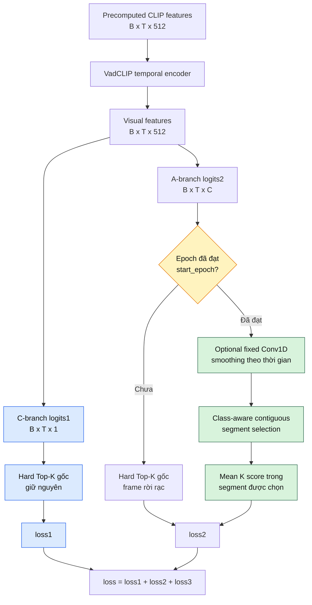

# Thiết kế thí nghiệm Temporal-aware Segment Top-K

## 1. Mục tiêu

Hard Top-K gốc của VadCLIP chọn các temporal position có score cao nhất mà không yêu
cầu chúng liên tục. Với video anomaly, các frame/clip bất thường thường tạo thành một
đoạn thời gian thay vì các điểm rời rạc. Thí nghiệm này thay phép chọn Top-K rời rạc ở
A-branch bằng một cửa sổ liên tục có độ dài K.

Phiên bản thử nghiệm đầu tiên chỉ thay A-branch:

- C-branch giữ nguyên hard Top-K gốc.
- A-branch giữ nguyên hard Top-K trước epoch kích hoạt.
- A-branch dùng class-aware temporal segment từ epoch kích hoạt.
- K vẫn dùng đúng công thức gốc `floor(T_valid / 16) + 1`.
- MIL loss, label và temporal encoder giữ nguyên. Evaluator vẫn frame-aligned;
  fixed smoothing chỉ được áp khi temporal post-process active và kernel lớn hơn 1.
- Conv1D smoothing là tùy chọn, dùng kernel cố định và không thêm tham số học.

Mục tiêu của phạm vi này là đo riêng ảnh hưởng của tính liên tục thời gian, không trộn
với Soft Top-K, Multi-K hoặc Adaptive Instance Selection.

## 2. Baseline VadCLIP

### 2.1. C-branch

C-branch tạo anomaly logits:

```text
logits1: [B, T, 1]
```

Với mỗi video, baseline sigmoid logits rồi chọn K temporal score lớn nhất:

```text
K = floor(T_valid / 16) + 1
z_C = mean(topK(sigmoid(logits1), K))
```

`z_C` được dùng để tính binary classification loss `loss1`.

### 2.2. A-branch

A-branch tạo class logits:

```text
logits2: [B, T, C]
```

Baseline chọn Top-K độc lập cho từng class:

```text
z_A[c] = mean(topK(logits2[:, c], K))
```

Các temporal position được chọn có thể nằm rải rác trong video. Vector `z_A [C]` được
dùng để tính weakly-supervised multi-class loss `loss2`.

## 3. Pipeline cập nhật



Màu xanh dương là phần giữ nguyên; màu xanh lá là cơ chế mới; màu vàng là điều kiện
chuyển theo epoch.

### Luồng theo epoch

Với `--temporal-segment-start-epoch 6` và tổng 10 epoch:

```text
Epoch 1–5
    C-branch: original hard Top-K
    A-branch: original hard Top-K

Epoch 6–10
    C-branch: original hard Top-K
    A-branch: class-aware contiguous segment Top-K
```

Điều kiện hiện tại chỉ dựa trên epoch:

```python
temporal_segment_active = (
    args.temporal_segment_topk
    and current_epoch >= args.temporal_segment_start_epoch
)
```

Không có điều kiện dựa trên loss, AUC, confidence hoặc độ ổn định của logits. Khi đã
chuyển sang temporal segment, training không quay lại hard Top-K rời rạc.

`start_epoch=6` chỉ là cấu hình warm-up ban đầu, không phải ràng buộc thuật toán. Cần
so sánh với `start_epoch=1` để biết warm-up có thực sự cần thiết hay không.

## 4. Class-aware temporal segment selection

Xét một video có valid length `T` và A-branch logits:

```text
S ∈ R^(T × C)
```

Mỗi class chọn một segment riêng. Vì vậy class `fighting` và `shooting` có thể chọn hai
vị trí thời gian khác nhau trong cùng video.

### 4.1. Không smoothing

Với mỗi class `c`, tính mean cho mọi cửa sổ liên tục dài K:

```text
m[s,c] = (1/K) × Σ S[t,c],  t = s ... s+K-1
```

Chọn cửa sổ tốt nhất:

```text
s*[c] = argmax_s m[s,c]
z[c]  = m[s*[c],c]
```

Output sau pooling:

```text
z ∈ R^C
```

### 4.2. Ví dụ

Giả sử một class có temporal scores:

```text
scores = [0.10, 0.92, 0.12, 0.78, 0.81, 0.09]
K = 2
```

Hard Top-K gốc chọn hai điểm rời rạc:

```text
positions = [1, 4]
pooled = mean(0.92, 0.81) = 0.865
```

Temporal Segment Top-K xét các cửa sổ liên tục:

```text
[0.10, 0.92] → 0.510
[0.92, 0.12] → 0.520
[0.12, 0.78] → 0.450
[0.78, 0.81] → 0.795  ← chọn
[0.81, 0.09] → 0.450
```

Segment được chọn là `[3,4]`, vì hai score cao xuất hiện liên tục.

## 5. Conv1D smoothing tùy chọn

Trước khi tìm segment, có thể smooth logits theo thời gian bằng depthwise Conv1D với
kernel trung bình cố định.

Với kernel lẻ `H = 2r + 1`:

```text
S_smooth[t,c] = (1/H) × Σ S[clamp(t+j),c],  j = -r ... r
```

Thiết kế hiện tại:

- Kernel áp dụng độc lập cho từng class.
- Replicate padding giữ nguyên temporal length.
- Kernel `1` là identity, tức không smoothing.
- Kernel phải là số nguyên dương lẻ.
- Kernel không học và không nằm trong optimizer.
- Segment selection và pooled value đều dùng score sau smoothing.

Lý do dùng fixed mean kernel trong phiên bản đầu:

- Không thêm tham số học mới.
- Tách ảnh hưởng smoothing khỏi ảnh hưởng model capacity.
- Dễ tái lập và giải thích.
- Không cần thay checkpoint architecture.

Learnable `nn.Conv1d` chỉ nên được thử ở ablation sau khi fixed smoothing đã được đánh
giá. Nếu dùng learnable Conv1D ngay, kết quả sẽ trộn hiệu ứng temporal continuity với
hiệu ứng của layer học mới.

## 6. Valid length và padding

Mỗi sample chỉ sử dụng logits trong phạm vi:

```text
scores = logits[i, :T_valid]
```

Padding không tham gia smoothing, segment selection hoặc pooling. K được giới hạn:

```text
K = min(T_valid, floor(T_valid / 16) + 1)
```

Số cửa sổ hợp lệ của một class:

```text
T_valid - K + 1
```

Nếu `T_valid = 1`, K được giới hạn bằng 1 và temporal segment trở thành chính temporal
score đó.

## 7. Gradient

`argmax` chọn segment là thao tác rời rạc, tương tự index selection trong hard Top-K.
Gradient chỉ truyền qua K score nằm trong segment đã chọn:

```text
loss2
  ↓
pooled class logits
  ↓
K score trong selected segment
  ↓
A-branch và temporal encoder
```

Khi smoothing kernel lớn hơn 1, mỗi score sau smoothing phụ thuộc thêm vào các temporal
neighbor. Do đó gradient có thể lan tới vùng lân cận quanh selected segment.

C-branch vẫn nhận gradient từ `loss1` theo hard Top-K gốc. Trong VadCLIP baseline,
A-branch còn liên kết với C-branch qua Visual Prompt; cơ chế này không bị thay bởi
Temporal Segment Top-K.

## 8. Training và inference

Temporal Segment Top-K thay cách tạo video-level logits cho `CLASM/loss2` trong
training:

```text
frame-level logits2 [B,T,C]
        ↓ temporal segment pooling
video-level logits [B,C]
        ↓ weak label
loss2
```

Khi test, evaluator vẫn giữ toàn bộ frame-level `logits2`, softmax và các metric
AUC/AP/mAP như baseline. Không crop hoặc xóa frame ngoài selected training segment.
Nếu temporal segment đã active, evaluator áp cùng fixed temporal smoothing lên valid
A-branch logits trước softmax:

```text
valid logits2 [T,C]
        ↓ fixed mean smoothing nếu kernel > 1
frame-level probabilities [T,C]
        ↓ evaluator gốc
AUC2/AP2 và detection mAP
```

Kernel `1` là exact identity nên kết quả số học khớp evaluator baseline. Kernel `3/5`
cố ý tạo temporal-aware evaluation nhưng vẫn giữ nguyên T. C-branch `AUC1/AP1` không
nhận post-process này.

Điều này quan trọng: selected segment là cơ chế weak-label training, không phải output
temporal localization cuối cùng.

## 9. Tương tác với các phương pháp khác

Trong phiên bản đầu, Temporal Segment Top-K yêu cầu:

```text
--topk-pooling mean
```

Và không được bật cùng:

```text
--adaptive-instance-selection
--topk-pooling soft
--topk-pooling multi_k
```

Lý do: mỗi phương pháp thay đổi cách chọn hoặc aggregate temporal instances. Kết hợp
ngay từ đầu sẽ không xác định được cải thiện đến từ continuity, weighting hay adaptive K.

Class Prototype cũng không nên kết hợp trong ablation Temporal Top-K đầu tiên. Trước
tiên đánh giá Temporal Segment trên text pipeline gốc; sau khi cả hai phương pháp đã có
baseline độc lập mới chạy cấu hình kết hợp.

## 10. Hyperparameter

| Tham số | Default thử nghiệm | Ý nghĩa |
|---|---:|---|
| `--temporal-segment-topk` | Tắt | Bật cơ chế segment cho A-branch |
| `--temporal-segment-start-epoch` | `6` | Epoch đầu tiên dùng segment |
| `--temporal-smoothing-kernel` | `1` | `1` không smoothing; `3/5` để smooth |
| `--checkpoint-metric` | `auc1` | Metric chọn best checkpoint |
| K | `floor(T_valid/16)+1` | Giữ K gốc của VadCLIP |
| C-branch pooling | Hard Top-K | Luôn giữ nguyên trong thử nghiệm đầu |
| A-branch pooling trước switch | Hard Top-K | Warm-up baseline |
| A-branch pooling sau switch | Segment mean | Cửa sổ liên tục, class-aware |

## 11. Ablation đề xuất

Giữ cố định seed, train/test split, batch size, learning rate, epoch, checkpoint policy và
evaluator.

| ID | A-branch | Start epoch | Smoothing | Mục đích |
|---|---|---:|---:|---|
| T0 | Hard Top-K gốc | — | — | Baseline |
| T1 | Temporal Segment | `1` | `1` | Segment từ đầu |
| T2 | Temporal Segment | `6` | `1` | Đo tác dụng warm-up |
| T3 | Temporal Segment | `6` | `3` | Fixed smoothing nhỏ |
| T4 | Temporal Segment | `6` | `5` | Fixed smoothing rộng hơn |

So sánh cần đọc như sau:

```text
T0 → T1: ảnh hưởng của contiguous segment khi dùng từ đầu
T1 → T2: ảnh hưởng riêng của epoch warm-up
T2 → T3: ảnh hưởng của smoothing kernel 3
T2 → T4: ảnh hưởng của smoothing kernel 5
```

Sau ablation trên mới cân nhắc:

- K theo tỷ lệ khác thay vì divisor 16.
- Nhiều segment trên một video.
- Segment length phụ thuộc class.
- Learnable Conv1D smoothing.
- Kết hợp Class Prototype.
- Kết hợp Adaptive Instance Selection.

## 12. Metric và log cần theo dõi

Metric chính:

- `AUC1`, `AP1`: C-branch.
- `AUC2`, `AP2`: A-branch chịu ảnh hưởng trực tiếp của temporal segment training.
- Detection mAP theo IoU.
- Average mAP.

Checkpoint mặc định vẫn chọn theo `AUC1` để giữ policy cũ:

```text
--checkpoint-metric auc1
```

Các lựa chọn khác (`ap1`, `auc2`, `ap2`, `average_map`) chỉ dùng khi mục tiêu ablation
yêu cầu. Không đổi checkpoint metric giữa các run trong cùng một bảng so sánh. Model
tiếp tục train từ current weights qua các epoch; best checkpoint không được nạp ngược
vào giữa training và chỉ được dùng để xuất model cuối.

Log bổ sung cần có:

- Epoch trước/sau switch.
- `temporal_segment_active`.
- Pooling của từng branch.
- Mean/min/max segment start index theo class.
- Mean selected segment score.
- Tỷ lệ overlap giữa segment các class.
- Peak VRAM và thời gian mỗi epoch.

Implementation hiện tại đã log trạng thái switch và pooling của từng branch, nhưng chưa
log segment indices. Việc thêm segment audit nên là bước tiếp theo nếu cần phân tích
localization.

## 13. Failure modes cần kiểm tra

1. **Anomaly xuất hiện thành nhiều đoạn rời rạc**: một segment duy nhất có thể bỏ sót sự
   kiện thứ hai.
2. **Anomaly ngắn hơn K**: mean với frame nền làm giảm score.
3. **Anomaly dài hơn K**: chỉ một phần sự kiện nhận gradient trực tiếp.
4. **Logits đầu training nhiễu**: segment có thể khóa vào vùng sai; đây là lý do thử
   warm-up.
5. **Smoothing quá mạnh**: kernel lớn làm mờ boundary và lan score sang background.
6. **Class gần nhau**: nhiều class có thể chọn cùng segment dù semantic khác nhau.
7. **Normal video**: class-wise argmax vẫn buộc chọn một segment cho từng anomaly class;
   loss phải học hạ score của các segment này.

## 14. Kiểm thử bắt buộc

Unit test:

1. Chọn đúng cửa sổ liên tục có mean lớn nhất.
2. Mỗi class có thể chọn start index khác nhau.
3. Không đọc score ngoài `T_valid`.
4. Kernel `1` giữ nguyên input.
5. Kernel chẵn hoặc không dương bị từ chối.
6. Smoothing giữ nguyên shape.
7. Gradient hữu hạn và truyền được qua selected segment.
8. K lớn hơn valid length được clamp.

Integration check:

1. Không bật flag phải tái hiện hard Top-K baseline.
2. Trước start epoch, A-branch dùng hard Top-K gốc.
3. Từ start epoch, chỉ A-branch chuyển sang segment.
4. C-branch không thay đổi.
5. Resume checkpoint giữ đúng epoch switch.
6. Không cho kết hợp AIS/Soft/Multi-K trong phiên bản đầu.

## 15. Lệnh Kaggle

### T0 — Baseline

```bash
!cd /kaggle/working/VadCLIP && \
set -o pipefail && \
python experiments/topk_variants/train_ucf.py \
  --train-list /kaggle/working/ucf_CLIP_rgb_kaggle.csv \
  --test-list /kaggle/working/ucf_CLIP_rgbtest_kaggle.csv \
  --topk-pooling mean \
  --checkpoint-metric auc1 \
  --model-path outputs/t0_baseline.pth \
  --checkpoint-path outputs/t0_baseline_checkpoint.pth \
  --log-path outputs/t0_baseline.log \
  2>&1 | tee outputs/t0_baseline_console.log
```

### T1 — Temporal Segment từ epoch 1

```bash
!cd /kaggle/working/VadCLIP && \
set -o pipefail && \
python experiments/topk_variants/train_ucf.py \
  --train-list /kaggle/working/ucf_CLIP_rgb_kaggle.csv \
  --test-list /kaggle/working/ucf_CLIP_rgbtest_kaggle.csv \
  --topk-pooling mean \
  --temporal-segment-topk \
  --temporal-segment-start-epoch 1 \
  --temporal-smoothing-kernel 1 \
  --checkpoint-metric auc1 \
  --model-path outputs/t1_temporal_start1.pth \
  --checkpoint-path outputs/t1_temporal_start1_checkpoint.pth \
  --log-path outputs/t1_temporal_start1.log \
  2>&1 | tee outputs/t1_temporal_start1_console.log
```

### T2 — Warm-up rồi chuyển ở epoch 6

```bash
!cd /kaggle/working/VadCLIP && \
set -o pipefail && \
python experiments/topk_variants/train_ucf.py \
  --train-list /kaggle/working/ucf_CLIP_rgb_kaggle.csv \
  --test-list /kaggle/working/ucf_CLIP_rgbtest_kaggle.csv \
  --topk-pooling mean \
  --temporal-segment-topk \
  --temporal-segment-start-epoch 6 \
  --temporal-smoothing-kernel 1 \
  --checkpoint-metric auc1 \
  --model-path outputs/t2_temporal_start6.pth \
  --checkpoint-path outputs/t2_temporal_start6_checkpoint.pth \
  --log-path outputs/t2_temporal_start6.log \
  2>&1 | tee outputs/t2_temporal_start6_console.log
```

### T3/T4 — Fixed Conv1D smoothing

Chạy lại lệnh T2 và đổi riêng:

```text
T3: --temporal-smoothing-kernel 3
T4: --temporal-smoothing-kernel 5
```

Mỗi cấu hình phải dùng model, checkpoint và log path riêng để không ghi đè artifact.

## 16. Tiêu chí quyết định

Temporal Segment Top-K chỉ được xem là có lợi khi:

- `AUC2/AP2` hoặc detection mAP tăng ổn định qua nhiều seed.
- C-branch không suy giảm đáng kể.
- Cải thiện không chỉ xuất hiện ở một checkpoint hoặc một action.
- Segment audit cho thấy vùng chọn có tính liên tục hợp lý, không chỉ dồn vào boundary.
- Chi phí tính toán và VRAM không tăng đáng kể.

Nếu T1 kém T0 nhưng T2 tốt hơn T1, warm-up có ích. Nếu T3/T4 kém T2, smoothing làm mờ
tín hiệu và nên giữ kernel 1. Nếu mọi biến thể segment đều kém baseline, giả định “một
anomaly tương ứng một đoạn liên tục” có thể không phù hợp với UCF-Crime hoặc K hiện tại.

## 17. Temporal Smoothness Loss: C-only và A-only

Temporal Smoothness Loss là regularizer trên raw model probability, khác với fixed
Conv1D smoothing. Nó không thay score bằng moving average:

```text
Fixed Conv1D:
score → moving average → pooling

Smoothness Loss:
score → giữ nguyên cho pooling
      └→ phạt |score[t+1] - score[t]|
```

Baseline vẫn dùng hard Top-K gốc khi không bật Temporal Segment. Loss tổng:

```text
L = loss1 + loss2 + loss3
  + lambda_C × smoothness_C
  + lambda_A × smoothness_A
```

Thiết kế activation không gắn cứng vào một epoch cụ thể. Người chạy chọn epoch bằng
`--temporal-smoothness-start-epoch`; cùng một code có thể bật từ epoch 1, 3, 6 hoặc bất
kỳ epoch dương nào. Mode `none` giữ nguyên baseline.

### 17.1. C-only

C anomaly probability:

```text
p_C = sigmoid(logits1)                       [B,T]
L_smooth_C = mean_b mean_t |p_C[t+1]-p_C[t]|
```

Chỉ các temporal pair trong `T_valid` tham gia loss. Mỗi video được mean riêng trước
khi mean theo batch, nên video dài không chi phối video ngắn.

Lệnh Kaggle:

```bash
!cd /kaggle/working/VadCLIP && \
mkdir -p outputs && \
set -o pipefail && \
python experiments/topk_variants/train_ucf.py \
  --train-list /kaggle/working/ucf_CLIP_rgb_kaggle.csv \
  --test-list /kaggle/working/ucf_CLIP_rgbtest_kaggle.csv \
  --topk-pooling mean \
  --temporal-smoothness-branch c \
  --temporal-smoothness-start-epoch 1 \
  --c-temporal-smoothness-weight 0.01 \
  --checkpoint-metric auc1 \
  --model-path outputs/smooth_c_only.pth \
  --checkpoint-path outputs/smooth_c_only_checkpoint.pth \
  --log-path outputs/smooth_c_only.log \
  2>&1 | tee outputs/smooth_c_only_console.log
```

Không truyền `--temporal-segment-topk`, nên cả C/A MIL pooling vẫn là hard Top-K gốc.

### 17.2. A-only

A anomaly probability dùng cùng định nghĩa với evaluator:

```text
p_A = 1 - softmax(logits2)[normal]            [B,T]
L_smooth_A = mean_b mean_t |p_A[t+1]-p_A[t]|
```

Lệnh Kaggle:

```bash
!cd /kaggle/working/VadCLIP && \
mkdir -p outputs && \
set -o pipefail && \
python experiments/topk_variants/train_ucf.py \
  --train-list /kaggle/working/ucf_CLIP_rgb_kaggle.csv \
  --test-list /kaggle/working/ucf_CLIP_rgbtest_kaggle.csv \
  --topk-pooling mean \
  --temporal-smoothness-branch a \
  --temporal-smoothness-start-epoch 1 \
  --a-temporal-smoothness-weight 0.05 \
  --checkpoint-metric auc1 \
  --model-path outputs/smooth_a_only.pth \
  --checkpoint-path outputs/smooth_a_only_checkpoint.pth \
  --log-path outputs/smooth_a_only.log \
  2>&1 | tee outputs/smooth_a_only_console.log
```

Penalty chỉ được tính từ A anomaly probability. Tuy nhiên, do A-branch dùng Visual
Prompt được tạo một phần từ `logits1` và hai branch dùng chung temporal encoder, gradient
A-only vẫn có thể ảnh hưởng gián tiếp tới C-branch. Vì vậy cần log cả AUC1 và AUC2.

### 17.3. CLI và giá trị mặc định

| Tham số | Giá trị | Ý nghĩa |
|---|---|---|
| `--temporal-smoothness-branch` | `none/c/a/both` | Chọn branch nhận penalty |
| `--temporal-smoothness-start-epoch` | `1` | Epoch bắt đầu regularization |
| `--c-temporal-smoothness-weight` | `0.01` | `lambda_C` |
| `--a-temporal-smoothness-weight` | `0.05` | `lambda_A` |
| `--checkpoint-metric` | `auc1` | Giữ policy chọn checkpoint theo AUC1 |

`none` là mặc định nên baseline không thay đổi. Mode `both` đã được hỗ trợ nhưng chỉ nên
chạy sau khi có kết quả C-only và A-only.

Weight không phải tham số của moving-average kernel. Nó chỉ nhân auxiliary loss:

```text
weighted_smooth_A = lambda_A × L_smooth_A
```

Không khai báo phép nhân tương đương cố định `lambda_A=1.0`, không phải loại bỏ weight.
Vì probability liền kề thường đã gần nhau và loss được mean theo thời gian rồi theo
batch, raw smoothness có thể nhỏ. Ví dụ run `smooth_a_only` quan sát ở epoch 10:

```text
avg_loss_smooth_a          = 0.002391
lambda_A                   = 0.05
avg_weighted_smooth_a      = 0.000120
loss1 + loss2 + loss3      ≈ 0.6938
weighted smooth / main loss ≈ 0.017%
```

`0.000120` không phải zero; UI hiển thị ít chữ số có thể làm nó trông như `0.000`.
Trong mode A-only, `weighted_smooth_c=0` là hành vi đúng. Không kết luận tác động chỉ từ
tỷ lệ scalar loss vì gradient scale cũng quan trọng; cần đối chiếu AUC/AP/mAP qua cùng
seed và checkpoint policy. Nếu ablate weight, giữ `0.05` làm mốc rồi thử riêng `0.5` và
`1.0`, không đổi đồng thời start epoch.

Cần phân biệt hai tham số độc lập:

| Cơ chế | Tham số activation | Default |
|---|---|---:|
| Temporal Segment Top-K | `--temporal-segment-start-epoch` | `6` |
| Temporal Smoothness Loss | `--temporal-smoothness-start-epoch` | `1` |

Thay đổi epoch của Temporal Segment không tự thay đổi epoch của Smoothness và ngược lại.

Hai trạng thái log cũng độc lập:

```text
temporal_smoothness_active=True
temporal_eval_active=False
```

Trạng thái trên là đúng cho A-only/C-only: regularizer đang chạy trong training, còn
fixed Conv1D post-process trong evaluator đang tắt. Smoothness Loss vẫn có thể thay đổi
metric gián tiếp thông qua model weights đã học.

Nếu kết hợp Temporal Segment Top-K với smoothness loss, bắt buộc dùng:

```text
--temporal-smoothing-kernel 1
```

để không trộn fixed moving-average smoothing với loss regularization.

### 17.4. Kiểm chứng activation epoch không bị hard-code

Activation Smoothness đi qua ba lớp: nhận giá trị từ CLI, validation, rồi kiểm tra ở đầu
mỗi epoch. Không có số epoch cố định trong điều kiện runtime.

#### A. CLI nhận epoch từ người dùng

Code trong `experiments/topk_variants/options.py`:

```python
parser.add_argument(
    '--temporal-smoothness-start-epoch',
    default=1,
    type=int,
    help='1-based epoch where temporal smoothness loss starts'
)
```

`default=1` chỉ là giá trị dùng khi người chạy không truyền argument. Giá trị này có thể
được override trực tiếp:

```bash
--temporal-smoothness-start-epoch 3
```

hoặc:

```bash
--temporal-smoothness-start-epoch 6
```

#### B. Validation chỉ yêu cầu epoch dương

Code trong `experiments/topk_variants/train_ucf.py`:

```python
smoothness_enabled = (
    args.temporal_smoothness_branch != 'none'
)

if (
    smoothness_enabled
    and args.temporal_smoothness_start_epoch < 1
):
    raise ValueError(
        '--temporal-smoothness-start-epoch must be at least 1'
    )
```

Validation không bắt buộc epoch 1 hoặc epoch 6; mọi số nguyên từ 1 trở lên đều hợp lệ.

#### C. Điều kiện runtime đọc trực tiếp giá trị CLI

Code được chạy ở đầu mỗi epoch trong `train_ucf.py`:

```python
temporal_smoothness_active = (
    smoothness_enabled
    and e + 1 >= args.temporal_smoothness_start_epoch
)
```

Trong đó:

```text
e + 1                                  = epoch hiện tại theo hệ 1-based
args.temporal_smoothness_start_epoch   = giá trị người dùng truyền qua CLI
```

Không có điều kiện kiểu:

```python
e + 1 >= 6
```

hoặc:

```python
e + 1 >= 5
```

#### D. Loss chỉ được tính khi cờ runtime bật

```python
loss_smooth_c = torch.zeros((), device=device)
loss_smooth_a = torch.zeros((), device=device)

if temporal_smoothness_active:
    if args.temporal_smoothness_branch in ('c', 'both'):
        loss_smooth_c = c_branch_temporal_smoothness(
            logits1, feat_lengths
        )

    if args.temporal_smoothness_branch in ('a', 'both'):
        loss_smooth_a = a_branch_temporal_smoothness(
            logits2, feat_lengths
        )
```

Trước start epoch, cả hai smoothness loss bằng 0. Từ start epoch trở đi, chỉ branch được
chọn mới nhận penalty.

#### E. Kiểm tra source bằng `rg`

Chạy trong repo:

```bash
rg -n "temporal-smoothness-start-epoch|temporal_smoothness_active" \
  experiments/topk_variants/options.py \
  experiments/topk_variants/train_ucf.py
```

Kiểm tra điều kiện có dùng argument:

```bash
rg -n "e \+ 1 >= args.temporal_smoothness_start_epoch" \
  experiments/topk_variants/train_ucf.py
```

Kiểm tra không có numeric epoch viết cứng cho Smoothness:

```bash
if rg -n "temporal_smoothness_active.*[0-9]|e \+ 1 >= [0-9]" \
  experiments/topk_variants/train_ucf.py; then
  echo "FAIL: phát hiện numeric activation threshold"
else
  echo "PASS: activation epoch được lấy từ CLI argument"
fi
```

Kết quả đúng là dòng `PASS`. Cách viết `if` này xử lý rõ exit code `1` mà `rg` trả về
khi không tìm thấy chuỗi; do đó notebook không báo nhầm đây là lỗi kiểm tra.

#### F. Kiểm tra parser nhận nhiều start epoch

```bash
python -B - <<'PY'
import sys

sys.path.insert(0, 'experiments/topk_variants')
from options import parser

for start_epoch in (1, 3, 6):
    args = parser.parse_args([
        '--temporal-smoothness-branch', 'c',
        '--temporal-smoothness-start-epoch', str(start_epoch),
    ])
    print(
        'requested=', start_epoch,
        'parsed=', args.temporal_smoothness_start_epoch,
    )
PY
```

Kết quả mong đợi:

```text
requested= 1 parsed= 1
requested= 3 parsed= 3
requested= 6 parsed= 6
```

#### G. Kiểm tra qua training log

Ví dụ chạy C-only với:

```bash
--temporal-smoothness-start-epoch 3
```

Log phải thể hiện:

```text
epoch=1 temporal_smoothness_active=False temporal_smoothness_branch=c
epoch=2 temporal_smoothness_active=False temporal_smoothness_branch=c
epoch=3 temporal_smoothness_active=True  temporal_smoothness_branch=c
epoch=4 temporal_smoothness_active=True  temporal_smoothness_branch=c
```

Đồng thời batch log trước epoch 3 phải có:

```text
loss_smooth_c=0.000000
weighted_smooth_c=0.000000
```

Từ epoch 3, các giá trị trên được tính từ `sigmoid(logits1)` và thường khác 0.

#### H. Lưu ý khi resume checkpoint

Start epoch là CLI configuration, chưa được lưu thành trường riêng trong checkpoint.
Khi resume phải truyền lại cùng cấu hình:

```bash
--use-checkpoint True \
--temporal-smoothness-branch c \
--temporal-smoothness-start-epoch 3 \
--c-temporal-smoothness-weight 0.01
```

Nếu resume với start epoch khác, code sẽ dùng giá trị mới. Training log luôn ghi lại
`temporal_smoothness_start_epoch` để có thể audit cấu hình thực tế.

### 17.5. Ví dụ thay đổi epoch mà không sửa code

C-only từ epoch 1:

```bash
--temporal-smoothness-branch c \
--temporal-smoothness-start-epoch 1
```

C-only warm-up hai epoch, bật từ epoch 3:

```bash
--temporal-smoothness-branch c \
--temporal-smoothness-start-epoch 3
```

A-only warm-up năm epoch, bật từ epoch 6:

```bash
--temporal-smoothness-branch a \
--temporal-smoothness-start-epoch 6
```

Baseline, không bao giờ bật Smoothness:

```bash
--temporal-smoothness-branch none
```

Nếu start epoch lớn hơn `--max-epoch`, Smoothness không được kích hoạt trong run đó. Ví
dụ `--max-epoch 10 --temporal-smoothness-start-epoch 20` tương đương không nhận penalty
trong 10 epoch, nhưng nên dùng mode `none` nếu mục tiêu là baseline rõ ràng.

### 17.6. Log cần so sánh

Training log ghi cả loss thô và loss sau nhân trọng số:

```text
loss_smooth_c
weighted_smooth_c
loss_smooth_a
weighted_smooth_a
```

Epoch summary ghi các giá trị trung bình tương ứng. Cần so sánh:

| ID | Smoothness branch | Segment | Mục đích |
|---|---|---:|---|
| B0 | `none` | Không | Baseline hard Top-K |
| C1 | `c` | Không | C-only smoothness |
| A1 | `a` | Không | A-only smoothness |

Giữ nguyên seed, dataset, batch size, learning rate, epoch và evaluator. Đọc cả
`AUC1/AP1`, `AUC2/AP2` và detection mAP; không chỉ so sánh một giá trị AUC.

### 17.7. Unit tests

Các test trong `tests/test_temporal_smoothness.py` kiểm tra:

- Constant temporal scores cho loss bằng 0.
- Padding ngoài `T_valid` bị bỏ qua.
- Mỗi video được mean riêng trước batch mean.
- Video một snippet trả differentiable zero.
- C-only dùng sigmoid probability.
- A-only dùng `1 - P(normal)`.
- Gradient A-only hữu hạn.
- Shape C-branch sai bị từ chối.
